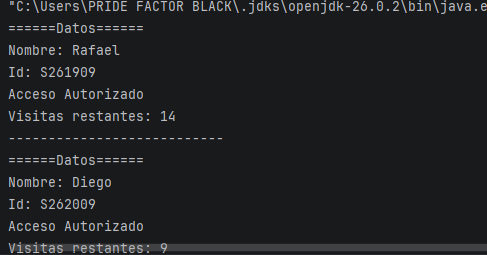
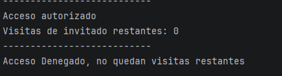

# 🏋️‍♂️ Sistema de Control de Acceso para Gimnasio en Java

Proyecto académico desarrollado en Java para modelar el control de acceso en torniquetes de un gimnasio, aplicando de forma rigurosa los pilares de la **Programación Orientada a Objetos (POO)**.

---

## 📋 Descripción del Proyecto

El sistema automatiza la verificación de acceso de los usuarios según el tipo de membresía con el que cuentan:
* **Membresía Básica (`MembresiaBasica`):** Acceso condicionado a un número limitado de visitas mensuales. Cada ingreso descuenta una visita hasta agotarse.
* **Membresía Premium (`MembresiaPremium`):** Acceso ilimitado al titular y control de pases de invitados especiales.

---

## 🧩 Aplicación de los Pilares de la POO

| Pilar | Aplicación en el Proyecto                                                                                                                                                          |
| :--- |:-----------------------------------------------------------------------------------------------------------------------------------------------------------------------------------|
| **Abstracción** | Clase abstracta `Membresia` que define los datos esenciales (`idMiembro`, `nombre`) y el comportamiento genérico de verificación mediante el método abstracto `verificarAcceso()`. |
| **Encapsulamiento** | Atributos privados (`visitasRestantes`, `pasesInvitado`) accesibles y modificables únicamente a través de métodos controlados (getters/métodos de negocio).                        |
| **Herencia** | Las clases `MembresiaBasica` y `MembresiaPremium` extienden de `Membresia` usando la palabra clave `extends` y reutilizan la lógica del padre invocando `super()`.                 |
| **Polimorfismo** | Colección de tipo `List<Membresia>` que almacena objetos de distintas clases hijas y ejecuta `verificarAcceso()` dinámicamente según la instancia concreta.                        |

---

## 🛠️ Código En Ejecución
### Mostrar datos y visitas restantes:

### Caso hipotetico de que no queden visitas:

### Dato necesario
Para la creación de este README ocupe la ayuda de Gemini IA, para que se viera bonito :)
